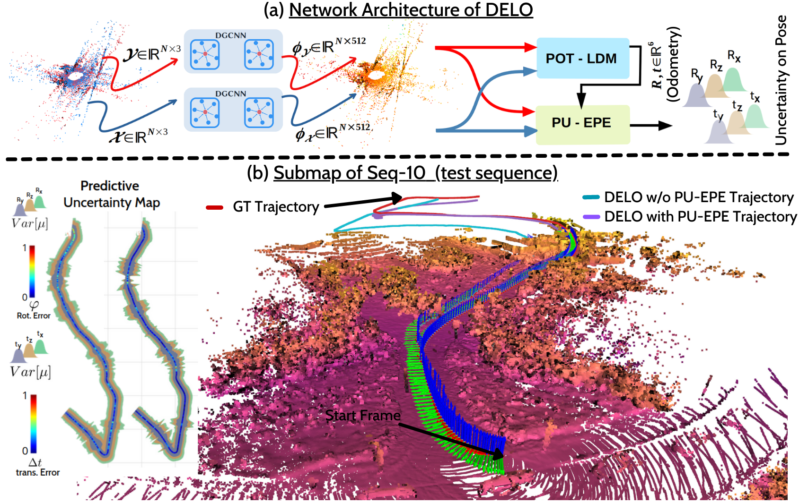

# DELO : Deep Evidential LiDAR Odometry using Partial Optimal Transport

The implementation of the paper 'DELO : Deep Evidential LiDAR Odometry using Partial Optimal Transport' (ICCV2023). [`ArXiv`](https://arxiv.org/pdf/2308.07153.pdf)



## Environment (Only in Linux x64 OS)
- Python 3.8
- CUDA 11.3 or above
- torch 1.12.1 and torchvision 0.14.1
- Open3d 0.15.2
- torchvision 0.13.1, torchmetrics 1.1.2
- Pytorch-Lightning 2.0.3
- lightning 2.0.9.post0

Create the conda environment using the following command (Only supports Linux OS). In future, we will setup a docker container to overcome any tedious environment setup that may arise.
```
conda env create -f environment.yml
conda activate DELO
```

  

## Data preparation
1. Download the KITTI LiDAR odometry dataset from the [`odometry benchmark`](https://www.cvlibs.net/datasets/kitti/eval_odometry.php). At the moment, one only needs to download **(1)** the Velodyne LiDAR data, **(2)** the groundtruth odometry poses, **(3)** the sensor calibration files and finally **(4)** the odometry development kit to debug if the downloaded files are okay. 

2. To replicate the exact evaluation and training samples as followed in DELO, run the training-split, testing-split, and evaluation-split by downloading the sample-Ids (e.g., 0000001, 00000008, ...) per odometry sequenes (e.g., 00, 02, 03, ...) saved as **train.npy**, **test.npy**, and **eval.npy** files from `./assets/train_test_eval_splits/`. Place the files under the downloaded dataset folders such that they match the following data structure

3. The expected data structure: 
    ```
    .
    └── KITTI ROOT PATH/
        ├── results/   
        ├── datasets/
        │   ├── poses/
        ├   ├   ├── 00.txt
        ├   ├   ├── 01.txt
        ├   ├   ├── ...
        ├   ├   ├── 10.txt      
        │   ├── sequences/
        ├   ├   ├── 00/
        ├   ├   ├   ├── poses.txt
        ├   ├   ├   ├── calib.txt
        ├   ├   ├   ├── times.txt
        ├   ├   ├   ├── train.npy
        ├   ├   ├   ├── eval.npy
        ├   ├   ├   ├── test.npy
        ├   ├   ├   ├── velodyne/
        ├   ├   ├   ├   ├── {8_digit_sampleID1}.bin
        ├   ├   ├   ├   ├── {8_digit_sampleID2}.bin
        ├   ├   ├   ├   ├── {...}.bin
        ├   ├   ├   ├   ├── {8_digit_sampleIDN}.bin
        ├   ├   ├── 01/
        ├   ├   ├   ├── poses.txt
        ├   ├   ├   ├── calib.txt
        ├   ├   ├   ├── times.txt
        ├   ├   ├   ├── train.npy
        ├   ├   ├   ├── eval.npy
        ├   ├   ├   ├── test.npy
        ├   ├   ├   ├── velodyne/
        ├   ├   ├   ├   ├── {8_digit_sampleID1}.bin
        ├   ├   ├   ├   ├── {8_digit_sampleID2}.bin
        ├   ├   ├   ├   ├── {...}.bin
        ├   ├   ├   ├   ├── {8_digit_sampleIDN}.bin
        ├   ├   ├   ...
        ├   ├   ├   ...
        ├   ├   ├── 10/
        ├   ├   ├   ├── poses.txt
        ├   ├   ├   ├── calib.txt
        ├   ├   ├   ├── times.txt
        ├   ├   ├   ├── train.npy
        ├   ├   ├   ├── eval.npy
        ├   ├   ├   ├── test.npy
        ├   ├   ├   ├── velodyne/
        ├   ├   ├   ├   ├── {8_digit_sampleID1}.bin
        ├   ├   ├   ├   ├── {8_digit_sampleID2}.bin
        ├   ├   ├   ├   ├── {...}.bin
        ├   ├   ├   ├   ├── {8_digit_sampleIDN}.bin        
        └── 
    ```

## Training
The training scripts are provided to run on SLURM cluster.The script will automatically create logging folder (either **train** or **test** inside the `/results/` folder or to the folder path set to the `$LOGDIR` variable inside `slum_*.sh` script files) and save the best checkpoints, as well as tensorboard log and any other metrics used for callback function. Therefore, appropritely set the environment variables 
```
src/scripts/env.sh
```
To start training use `train.py`, e.g.
```
python3 train.py 
--acceleratorType cuda \
--model_name {dcp|delo} \ 
--dataset_type Kitti \
--noise_type downsample \ 
--train_data_dir "$KITTI_TRAIN_DATASET_PATH" \ 
--test_data_dir "$KITTI_TEST_DATASET_PATH" \
--log_dir $LOGDIR \
--periodic_save_dir $LOGDIR \ 
--max_epochs 200 \
--num_points 1024 \
--train_batch_size 16 \ 
--val_batch_size 16 \
--head partial \
--use_evidence False
```

To train for DELO with **Predictive Uncertainty for Evidential Pose Estimation**, turn on the flag `--use_evidence True` 


## Citation
```
@inproceedings{ali2023delo,
title={DELO: Deep Evidential LiDAR Odometry using Partial Optimal Transport},
author={Ali, Sk Aziz and Aouada, Djamila and Reis, Gerd and Stricker, Didier},
booktitle={Proceedings of the IEEE/CVF International Conference on Computer Vision},
pages={4517--4526},
year={2023}
}

@inproceedings{ali2021RPSRNet,
author={Ali, Sk Aziz and Kahraman, Kerem and Reis, Gerd and Stricker, Didier},
booktitle={2021 IEEE/CVF Conference on Computer Vision and Pattern Recognition (CVPR)},
title={RPSRNet: End-to-End Trainable Rigid Point Set Registration Network using Barnes-Hut 2D-Tree Representation},
year={2021},
doi={10.1109/CVPR46437.2021.01290}
} 
```
